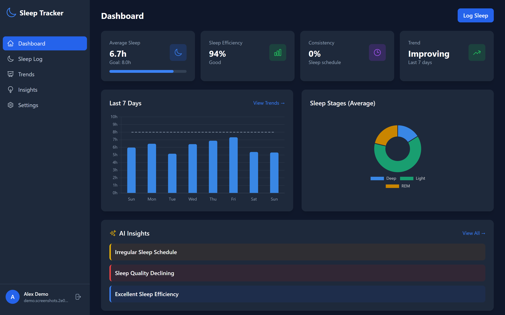
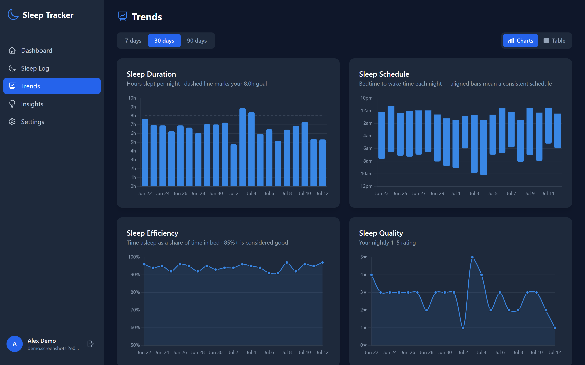
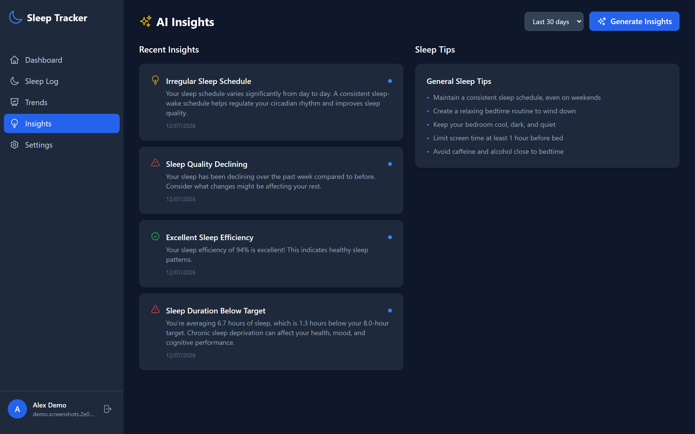
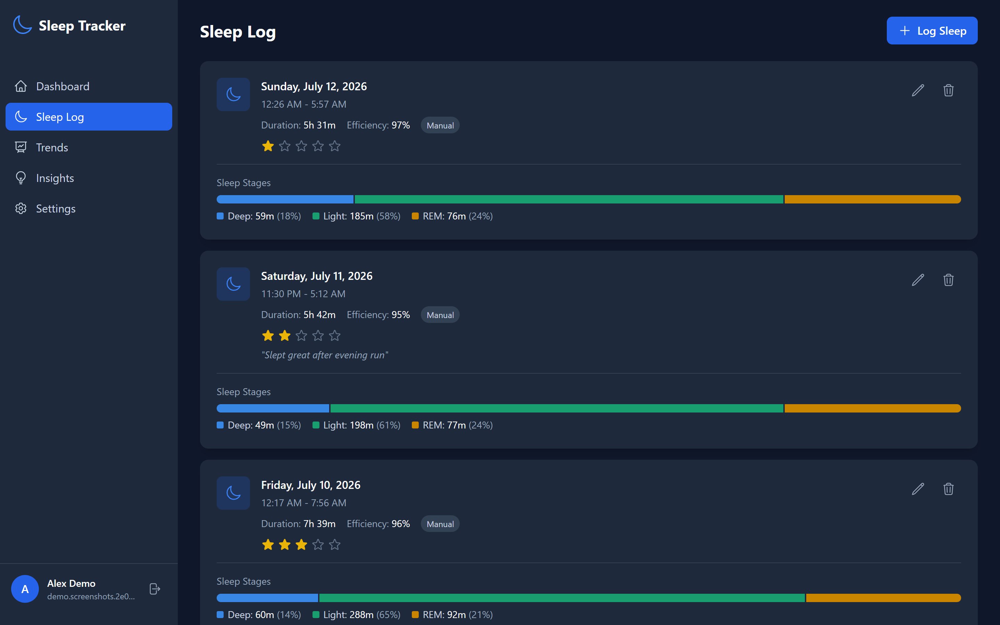
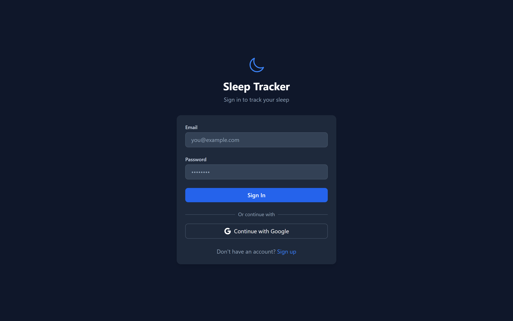

# Sleep Tracker

A sleep tracking application with AI-powered insights, Fitbit integration, and Firebase authentication.



## Features

- **User Authentication**: Secure login with Firebase (Email/Password + Google Sign-in)
- **Manual Sleep Logging**: Log your sleep with quality ratings and notes
- **Fitbit Integration**: Connect via OAuth and sync sleep data from your Fitbit device, with sync history logs
- **AI-Powered Insights**: Personalized sleep analysis from a self-hosted Ollama model, generated in the background and polled by the UI (falls back to rule-based analysis when the model is unreachable)
- **Interactive Dashboard**: Visualize sleep patterns, statistics, and trends with charts
- **Sleep Goals**: Set sleep targets and track progress against them

## Screenshots

| Trends | AI Insights |
|---|---|
|  |  |

| Sleep Log | Login |
|---|---|
|  |  |

## Tech Stack

### Backend
- **Django 4.2** with **Django REST Framework**: RESTful API
- **Firebase Admin SDK**: Server-side token verification (custom DRF authentication class)
- **Self-hosted Ollama (`qwen2.5:7b-instruct`)**: AI insights generated on your own inference server (falls back to rule-based analysis when the server is unreachable)
- **Celery + Redis**: Insight generation runs as a task on a separate worker process; a beat schedule embedded in that same worker reaps stale jobs every 5 minutes
- **SQLite** (local default) / **PostgreSQL** (via `DATABASE_URL` or `DB_*` vars)
- **WhiteNoise + Gunicorn**: Static files and production serving

### Frontend
- **React 18** + **TypeScript** with **Vite** (dev server on port 3000, proxies `/api` to the backend)
- **Tailwind CSS**, **Headless UI**, **Heroicons**: Styling and UI components
- **Chart.js** (react-chartjs-2): Data visualization
- **Zustand**: State management (auth + sleep stores)
- **React Router**: Navigation with protected routes
- **Axios**, **React Hook Form**, **react-hot-toast**, **date-fns**

## Project Structure

```
sleepinsight/
├── backend/                  # Django backend
│   ├── sleep_tracker/        # Project settings & root URLconf
│   ├── users/                # Custom user model, Firebase auth, profiles
│   ├── sleep/                # Sleep records & goals
│   ├── fitbit_integration/   # Fitbit OAuth, sync & sync logs
│   ├── ai_insights/          # AI-powered analysis (self-hosted Ollama, Celery tasks)
│   ├── bin/                  # web/worker entrypoints - shared by the
│   │                         # Dockerfile CMD and fly.toml [processes]
│   ├── build.sh              # Render build script
│   ├── Procfile              # Gunicorn start command
│   └── requirements.txt
│
├── frontend/                 # React frontend
│   ├── src/
│   │   ├── components/       # Layout, ProtectedRoute, charts
│   │   ├── pages/            # Dashboard, SleepLog, Trends, Insights,
│   │   │                     # Settings, Login, Register, FitbitCallback
│   │   ├── services/         # API client (axios) & Firebase
│   │   ├── stores/           # Zustand stores (auth, sleep)
│   │   └── config.ts         # Firebase & API configuration
│   ├── vercel.json           # Vercel deployment config
│   └── package.json
│
├── render.yaml               # Render blueprint (API + PostgreSQL)
└── README.md
```

## How It Works

Authentication is fully delegated to Firebase: the React app signs the user in with the Firebase Web SDK and attaches the resulting ID token to every API request. On the backend, a custom DRF authentication class verifies the token with the Firebase Admin SDK and automatically provisions a local Django user on first sight; there is no separate registration endpoint or session/JWT handling to configure.

Sleep data comes from two sources that share the same models: manual entries created in the UI, and records imported through the Fitbit OAuth integration. The insights module summarizes recent records (duration, efficiency, sleep stages, consistency, sleep debt) and sends that summary to a self-hosted Ollama server. Because CPU inference takes minutes, generation runs as a Celery task on a separate worker process and the UI polls for the result; if the model is unreachable, slow, or returns malformed output, the app falls back to built-in rule-based analysis and tells the user it did so.

## Getting Started

### Prerequisites

- Python 3.10+
- Node.js 18+
- Firebase project (required, handles all authentication)
- Fitbit Developer account (optional, only for device sync)
- Self-hosted Ollama server (optional, AI insights fall back to rule-based analysis if unavailable)
- Redis (required to run the Celery worker; without it, AI insight requests stay `queued` forever - even the rule-based fallback path runs as a Celery task)

### Setting Up the Inference Server (optional)

Insights are generated by an Ollama server you host. These steps target an
Oracle Cloud Ampere A1 instance (ARM64, CPU-only) since that's what I'm using, but any Linux box works.

1. **Install Ollama and pull the model:**

   ```bash
   curl -fsSL https://ollama.com/install.sh | sh
   ollama pull qwen2.5:7b-instruct
   ```

   On 4 A1 cores expect 1.5–3 minutes per generation. Use `qwen2.5:3b-instruct`
   if that is too slow then use a smaller model by changing `OLLAMA_MODEL` in the config.

2. **Keep the model resident** so the first request of the day is not 30 seconds
   slower. Add to `/etc/systemd/system/ollama.service.d/override.conf`:

   ```ini
   [Service]
   Environment="OLLAMA_KEEP_ALIVE=-1"
   ```

   Then `sudo systemctl daemon-reload && sudo systemctl restart ollama`.

   **Leave Ollama bound to `127.0.0.1`.** It has no authentication of its own;
   Caddy is what stands between it and the internet.

3. **Point a DNS name at the instance** since Caddy needs a resolvable hostname to obtain a Let's Encrypt certificate.

4. **Install Caddy** and use this `Caddyfile`, which rejects anything without
   the right bearer token:

   ```
   llm.example.com {
       @unauthorized not header Authorization "Bearer {env.OLLAMA_TOKEN}"
       respond @unauthorized "Unauthorized" 401
       reverse_proxy 127.0.0.1:11434 {
           header_up Host {upstream_hostport}
       }
   }
   ```

   Put `OLLAMA_TOKEN` in Caddy's systemd environment, not in the Caddyfile.

   The `header_up Host` line is required. Ollama rejects requests whose `Host`
   header is not local — a DNS-rebinding protection — so without it Ollama
   returns a bare `403` even when your token is correct. Rewriting the header
   makes the proxy hop look like what it is: a local request. Verify with
   `curl -H "Authorization: Bearer wrong" https://llm.example.com/api/tags`,
   which should return `401` (Caddy rejecting you); a `403` there means the
   request reached Ollama and this line is missing.

5. **Open port 443 (and only 443!!).** On OCI this takes two steps, and skipping
   the second is will probably make the server appear dead:

   ```bash
   # 1. Add an ingress rule for TCP 443 in the VCN security list (OCI console)
   # 2. Allow it at the host firewall too:
   sudo iptables -I INPUT 1 -p tcp --dport 443 -j ACCEPT
   sudo netfilter-persistent save
   ```

6. **Verify from the backend:**

   ```bash
   OLLAMA_BASE_URL=https://llm.example.com OLLAMA_API_KEY=your-token \
     python manage.py check_ollama
   ```

   This reports reachability, auth, model availability, and round-trip time,
   naming the likely cause for each failure mode.

### Setting up the app (local version)

#### 1. Clone the Repository

```bash
git clone https://github.com/hhzks/sleep-insight-app.git
cd sleep-insight-app
```

#### 2. Firebase Setup

1. Create a new project at [Firebase Console](https://console.firebase.google.com)
2. Enable Authentication with Email/Password and Google providers
3. Generate a new service account key:
   - Go to Project Settings > Service Accounts
   - Click "Generate new private key"
   - Save the JSON file securely (you'll copy values from it into `.env`)

#### 3. Fitbit Setup (Optional)

1. Register an app at [Fitbit Developer](https://dev.fitbit.com/apps)
2. Set OAuth 2.0 Application Type to "Personal"
3. Set Callback URL to `http://localhost:3000/fitbit/callback`
4. Note your Client ID and Client Secret

#### 4. Backend Setup

```bash
# Navigate to backend directory
cd backend

# Create virtual environment
python -m venv venv

# Activate virtual environment
# Windows:
venv\Scripts\activate
# macOS/Linux:
source venv/bin/activate

# Install dependencies
pip install -r requirements.txt

# Copy environment file and configure
cp .env.example .env
# Edit .env with your credentials

# Run migrations
python manage.py migrate

# Create superuser (optional)
python manage.py createsuperuser

# Start development server
python manage.py runserver
```

AI insight generation additionally needs a Redis broker and a Celery worker
consuming from it - `manage.py runserver` alone only queues the job. Start
Redis (`docker run --rm -p 6379:6379 redis:7-alpine` works), then in a
second terminal with the virtualenv active:

```bash
celery -A sleep_tracker worker --loglevel=info
```

This is optional if you don't need AI insights; the rest of the app runs
without it.

#### 5. Frontend Setup

```bash
# Navigate to frontend directory
cd frontend

# Install dependencies
npm install

# Copy environment file and configure
cp .env.example .env.local
# Edit .env.local with your Firebase config

# Start development server
npm run dev
```

#### 6. Access the Application

- Frontend: http://localhost:3000
- Backend API: http://localhost:8000/api
- Django Admin: http://localhost:8000/admin

Steps for hosting are listed below

### Configuration

#### Backend Environment Variables

See `backend/.env.example` for the full template.

| Variable | Description |
|----------|-------------|
| `DJANGO_SECRET_KEY` | Django secret key |
| `DEBUG` | Enable debug mode (defaults to `True` locally) |
| `ALLOWED_HOSTS` | Comma-separated allowed hosts |
| `CORS_ALLOWED_ORIGINS` | Comma-separated allowed frontend origins |
| `DATABASE_URL` | Full database URL (takes priority; used on Render) |
| `DB_NAME`, `DB_USER`, `DB_PASSWORD`, `DB_HOST`, `DB_PORT` | PostgreSQL settings (used if `DATABASE_URL` is unset; falls back to SQLite) |
| `FIREBASE_PROJECT_ID` | Firebase project ID |
| `FIREBASE_PRIVATE_KEY` | Firebase service account private key |
| `FIREBASE_CLIENT_EMAIL` | Firebase service account email |
| `FITBIT_CLIENT_ID` | Fitbit OAuth client ID |
| `FITBIT_CLIENT_SECRET` | Fitbit OAuth client secret |
| `FITBIT_REDIRECT_URI` | Fitbit OAuth callback URL (defaults to `http://localhost:3000/fitbit/callback`) |
| `OLLAMA_BASE_URL` | Ollama server URL (defaults to `http://localhost:11434`) |
| `OLLAMA_API_KEY` | Ollama bearer token (blank locally; set for production proxies) |
| `OLLAMA_MODEL` | Model name (defaults to `qwen2.5:7b-instruct`) |
| `OLLAMA_TIMEOUT_SECONDS` | Max generation time in seconds (defaults to 300) |
| `OLLAMA_NUM_PREDICT` | Max tokens the model may generate per response (defaults to 1000) |
| `OLLAMA_TEMPERATURE` | Sampling temperature for generation (defaults to 0.7) |
| `OLLAMA_INVALID_RETRIES` | Retries after malformed model output before falling back to rules (defaults to 1) |
| `INSIGHT_JOB_STALE_MINUTES` | Max job age before reaper kills it (defaults to 15) |
| `CELERY_BROKER_URL` | Redis URL for the Celery broker (defaults to `redis://localhost:6379/0`) |

Generation runs as a Celery task with a soft and a hard time limit derived from `OLLAMA_TIMEOUT_SECONDS`, and the stale-job reaper (`INSIGHT_JOB_STALE_MINUTES`) must not fire before Celery's own hard kill does. The enforced ordering, checked at startup by `ai_insights.E001`, is:

```
worst case  <  soft limit  <  hard limit  <  stale window
OLLAMA_TIMEOUT_SECONDS * (1 + OLLAMA_INVALID_RETRIES)  <  worst case + 60  <  soft limit + 60  <  INSIGHT_JOB_STALE_MINUTES * 60
```

With the defaults (`OLLAMA_TIMEOUT_SECONDS=300`, `OLLAMA_INVALID_RETRIES=1`, `INSIGHT_JOB_STALE_MINUTES=15`) that's `600 < 660 < 720 < 900`. If you raise `OLLAMA_TIMEOUT_SECONDS`, raise `INSIGHT_JOB_STALE_MINUTES` to match or the reaper will kill jobs Celery is still legitimately running.

### Frontend Environment Variables

See `frontend/.env.example` for the full template.

| Variable | Description |
|----------|-------------|
| `VITE_FIREBASE_API_KEY` | Firebase Web API key |
| `VITE_FIREBASE_AUTH_DOMAIN` | Firebase auth domain |
| `VITE_FIREBASE_PROJECT_ID` | Firebase project ID |
| `VITE_FIREBASE_STORAGE_BUCKET` | Firebase storage bucket |
| `VITE_FIREBASE_MESSAGING_SENDER_ID` | Firebase messaging sender ID |
| `VITE_FIREBASE_APP_ID` | Firebase app ID |
| `VITE_API_BASE_URL` | Backend API URL (defaults to `http://localhost:8000/api`) |

## API Endpoints

### Authentication
All endpoints require a Firebase ID token in the Authorization header:
```
Authorization: Bearer <firebase-id-token>
```

List endpoints are paginated (20 per page).

### Users
- `GET /api/users/me/` - Get current user profile
- `PATCH /api/users/me/` - Update profile
- `PATCH /api/users/preferences/` - Update preferences

### Sleep Records
- `GET /api/sleep/records/` - List sleep records
- `POST /api/sleep/records/` - Create sleep record
- `GET /api/sleep/records/{id}/` - Get sleep record
- `PATCH /api/sleep/records/{id}/` - Update sleep record
- `DELETE /api/sleep/records/{id}/` - Delete sleep record
- `GET /api/sleep/records/statistics/` - Get statistics
- `GET /api/sleep/records/recent/` - Get recent records
- `GET /api/sleep/records/trends/` - Get trends

### Sleep Goals
- `GET /api/sleep/goals/` - Get sleep goals
- `POST /api/sleep/goals/` - Create/update goals
- `GET /api/sleep/goals/progress/` - Get progress

### Fitbit Integration
- `GET /api/fitbit/auth-url/` - Get OAuth URL
- `POST /api/fitbit/callback/` - Handle OAuth callback
- `GET /api/fitbit/status/` - Get connection status
- `DELETE /api/fitbit/status/` - Disconnect Fitbit
- `POST /api/fitbit/sync/` - Sync sleep data
- `GET /api/fitbit/sync-logs/` - Get sync history

### AI Insights
- `POST /api/insights/generate/` - Generate AI insights
- `GET /api/insights/list/` - List saved insights
- `GET /api/insights/{id}/` - Get insight details
- `GET /api/insights/tips/` - Get sleep tips
- `GET /api/insights/tips/{category}/` - Get tips by category
- `GET /api/insights/quick/` - Get quick summary

## Development

### Tests

```bash
# Backend (Django test runner)
cd backend
python manage.py test

# Frontend (Vitest)
cd frontend
npm test
```

### Linting

```bash
cd frontend
npm run lint
```

### Database Migrations

```bash
cd backend
python manage.py makemigrations
python manage.py migrate
```

## Deployment

The repository ships with configuration for Render (backend + database) and Vercel (frontend).

### Backend — Render

`render.yaml` defines a blueprint with:
- A **web service** (`sleep-tracker-api`) that runs `backend/build.sh` (installs dependencies, collects static files, runs migrations) and serves with Gunicorn
- A free **PostgreSQL database** wired in via `DATABASE_URL`

Create a Blueprint on [Render](https://render.com) pointed at this repository, then fill in the environment variables marked `sync: false` (Firebase, Fitbit, CORS origins, AI keys) in the dashboard.

`render.yaml` defines no worker service, so AI insight generation (a Celery task - see Tech Stack) has no process to run it on Render; jobs will queue and never complete. The rest of the app is unaffected. `backend/fly.toml` is the deployment target that runs the worker, via the `web`/`worker` process groups in `[processes]`.

### Frontend — Vercel

`frontend/vercel.json` configures the Vite build with SPA rewrites. Import the repository into [Vercel](https://vercel.com) with `frontend` as the root directory and set the `VITE_*` environment variables (point `VITE_API_BASE_URL` at your deployed backend, e.g. `https://<your-service>.onrender.com/api`).

Or build manually:

```bash
cd frontend
npm run build
# Deploy the 'dist' folder to your hosting service
```

## License

MIT License
